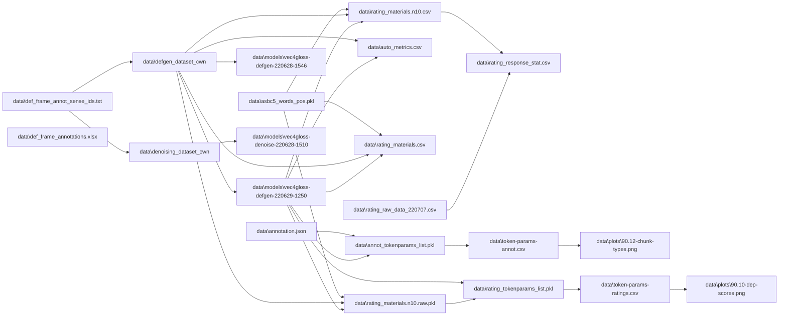

```mermaid
flowchart LR
	node1["data\annot_tokenparams_list.pkl"]
	node2["data\annotation.json"]
	node3["data\asbc5_words_pos.pkl"]
	node4["data\auto_metrics.csv"]
	node5["data\def_frame_annot_sense_ids.txt"]
	node6["data\defgen_dataset_cwn"]
	node7["data\denoising_dataset_cwn"]
	node8["data\models\vec4gloss-defgen-220628-1546"]
	node9["data\models\vec4gloss-defgen-220629-1250"]
	node10["data\models\vec4gloss-denoise-220628-1510"]
	node11["data\plots\90.10-dep-scores.png"]
	node12["data\plots\90.12-chunk-types.png"]
	node13["data\rating_materials.csv"]
	node14["data\rating_materials.n10.csv"]
	node15["data\rating_materials.n10.raw.pkl"]
	node16["data\rating_raw_data_220707.csv"]
	node17["data\rating_response_stat.csv"]
	node18["data\rating_tokenparams_list.pkl"]
	node19["data\token-params-annot.csv"]
	node20["data\token-params-ratings.csv"]
	node1-->node19
	node2-->node1
	node3-->node13
	node3-->node14
	node3-->node15
	node5-->node6
	node5-->node7
	node6-->node4
	node6-->node8
	node6-->node9
	node6-->node13
	node6-->node14
	node6-->node15
	node7-->node10
	node9-->node1
	node9-->node4
	node9-->node13
	node9-->node14
	node9-->node15
	node9-->node18
	node14-->node17
	node15-->node18
	node16-->node17
	node18-->node20
	node19-->node12
	node20-->node11
	node21["data\def_frame_annotations.xlsx"]
```
