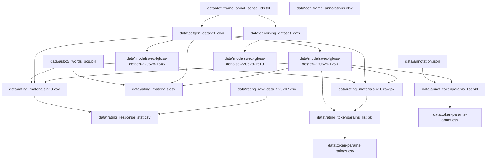

```mermaid
flowchart TD
	node1["data\annot_tokenparams_list.pkl"]
	node2["data\annotation.json"]
	node3["data\asbc5_words_pos.pkl"]
	node4["data\def_frame_annot_sense_ids.txt"]
	node5["data\defgen_dataset_cwn"]
	node6["data\denoising_dataset_cwn"]
	node7["data\models\vec4gloss-defgen-220628-1546"]
	node8["data\models\vec4gloss-defgen-220629-1250"]
	node9["data\models\vec4gloss-denoise-220628-1510"]
	node10["data\rating_materials.csv"]
	node11["data\rating_materials.n10.csv"]
	node12["data\rating_materials.n10.raw.pkl"]
	node13["data\rating_raw_data_220707.csv"]
	node14["data\rating_response_stat.csv"]
	node15["data\rating_tokenparams_list.pkl"]
	node16["data\token-params-annot.csv"]
	node17["data\token-params-ratings.csv"]
	node1-->node16
	node2-->node1
	node3-->node10
	node3-->node11
	node3-->node12
	node4-->node5
	node4-->node6
	node5-->node7
	node5-->node8
	node5-->node10
	node5-->node11
	node5-->node12
	node6-->node9
	node8-->node1
	node8-->node10
	node8-->node11
	node8-->node12
	node8-->node15
	node11-->node14
	node12-->node15
	node13-->node14
	node15-->node17
	node18["data\def_frame_annotations.xlsx"]
```
