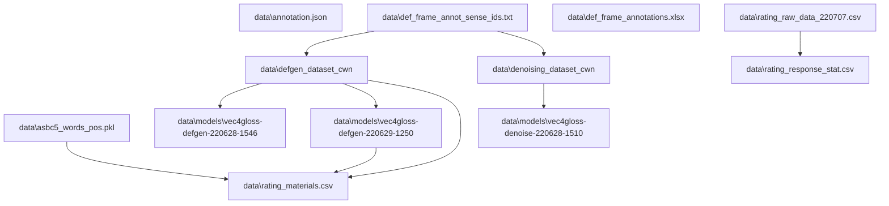

```mermaid
flowchart TD
	node1["data\annotation.json"]
	node2["data\asbc5_words_pos.pkl"]
	node3["data\def_frame_annot_sense_ids.txt"]
	node4["data\defgen_dataset_cwn"]
	node5["data\denoising_dataset_cwn"]
	node6["data\models\vec4gloss-defgen-220628-1546"]
	node7["data\models\vec4gloss-defgen-220629-1250"]
	node8["data\models\vec4gloss-denoise-220628-1510"]
	node9["data\rating_materials.csv"]
	node2-->node9
	node3-->node4
	node3-->node5
	node4-->node6
	node4-->node7
	node4-->node9
	node5-->node8
	node7-->node9
	node10["data\def_frame_annotations.xlsx"]
	node11["data\rating_raw_data_220707.csv"]
	node12["data\rating_response_stat.csv"]
	node11-->node12
```
