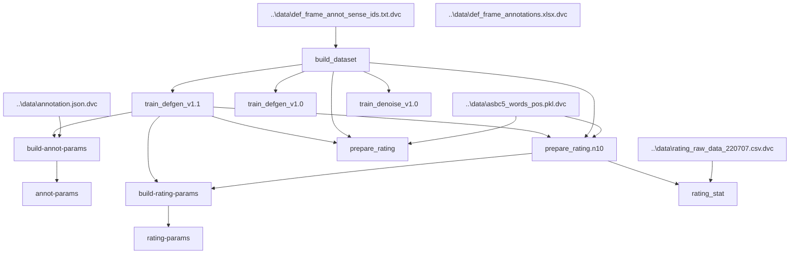

```mermaid
flowchart TD
	node1["..\data\annotation.json.dvc"]
	node2["..\data\asbc5_words_pos.pkl.dvc"]
	node3["..\data\def_frame_annot_sense_ids.txt.dvc"]
	node4["..\data\rating_raw_data_220707.csv.dvc"]
	node5["annot-params"]
	node6["build-annot-params"]
	node7["build-rating-params"]
	node8["build_dataset"]
	node9["prepare_rating"]
	node10["prepare_rating.n10"]
	node11["rating-params"]
	node12["rating_stat"]
	node13["train_defgen_v1.0"]
	node14["train_defgen_v1.1"]
	node15["train_denoise_v1.0"]
	node1-->node6
	node2-->node9
	node2-->node10
	node3-->node8
	node4-->node12
	node6-->node5
	node7-->node11
	node8-->node9
	node8-->node10
	node8-->node13
	node8-->node14
	node8-->node15
	node10-->node7
	node10-->node12
	node14-->node6
	node14-->node7
	node14-->node9
	node14-->node10
	node16["..\data\def_frame_annotations.xlsx.dvc"]
```
