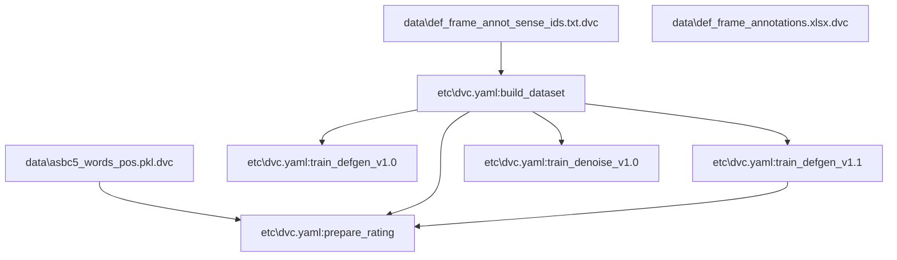

```mermaid
flowchart TD
	node1["data\asbc5_words_pos.pkl.dvc"]
	node2["data\def_frame_annot_sense_ids.txt.dvc"]
	node3["etc\dvc.yaml:build_dataset"]
	node4["etc\dvc.yaml:prepare_rating"]
	node5["etc\dvc.yaml:train_defgen_v1.0"]
	node6["etc\dvc.yaml:train_defgen_v1.1"]
	node7["etc\dvc.yaml:train_denoise_v1.0"]
	node1-->node4
	node2-->node3
	node3-->node4
	node3-->node5
	node3-->node6
	node3-->node7
	node6-->node4
	node8["data\def_frame_annotations.xlsx.dvc"]
```
