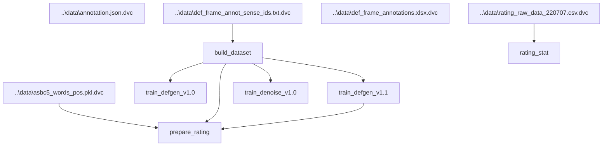

```mermaid
flowchart TD
	node1["..\data\annotation.json.dvc"]
	node2["..\data\asbc5_words_pos.pkl.dvc"]
	node3["..\data\def_frame_annot_sense_ids.txt.dvc"]
	node4["build_dataset"]
	node5["prepare_rating"]
	node6["train_defgen_v1.0"]
	node7["train_defgen_v1.1"]
	node8["train_denoise_v1.0"]
	node2-->node5
	node3-->node4
	node4-->node5
	node4-->node6
	node4-->node7
	node4-->node8
	node7-->node5
	node9["..\data\def_frame_annotations.xlsx.dvc"]
	node10["..\data\rating_raw_data_220707.csv.dvc"]
	node11["rating_stat"]
	node10-->node11
```
