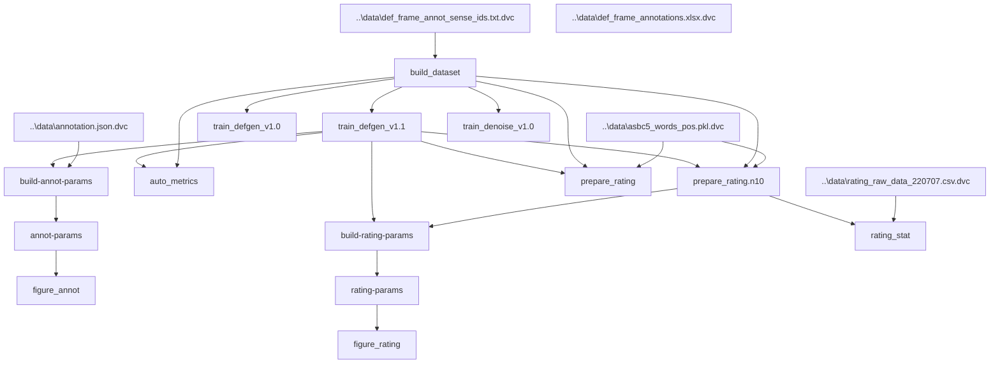

```mermaid
flowchart TD
	node1["..\data\annotation.json.dvc"]
	node2["..\data\asbc5_words_pos.pkl.dvc"]
	node3["..\data\def_frame_annot_sense_ids.txt.dvc"]
	node4["..\data\rating_raw_data_220707.csv.dvc"]
	node5["annot-params"]
	node6["auto_metrics"]
	node7["build-annot-params"]
	node8["build-rating-params"]
	node9["build_dataset"]
	node10["figure_annot"]
	node11["figure_rating"]
	node12["prepare_rating"]
	node13["prepare_rating.n10"]
	node14["rating-params"]
	node15["rating_stat"]
	node16["train_defgen_v1.0"]
	node17["train_defgen_v1.1"]
	node18["train_denoise_v1.0"]
	node1-->node7
	node2-->node12
	node2-->node13
	node3-->node9
	node4-->node15
	node5-->node10
	node7-->node5
	node8-->node14
	node9-->node6
	node9-->node12
	node9-->node13
	node9-->node16
	node9-->node17
	node9-->node18
	node13-->node8
	node13-->node15
	node14-->node11
	node17-->node6
	node17-->node7
	node17-->node8
	node17-->node12
	node17-->node13
	node19["..\data\def_frame_annotations.xlsx.dvc"]
```
