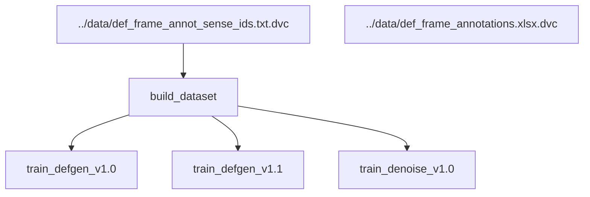

```mermaid
flowchart TD
	node1[../data/def_frame_annot_sense_ids.txt.dvc]
	node2[build_dataset]
	node3[train_defgen_v1.0]
	node4[train_defgen_v1.1]
	node5[train_denoise_v1.0]
	node1-->node2
	node2-->node3
	node2-->node4
	node2-->node5
	node6[../data/def_frame_annotations.xlsx.dvc]
```
